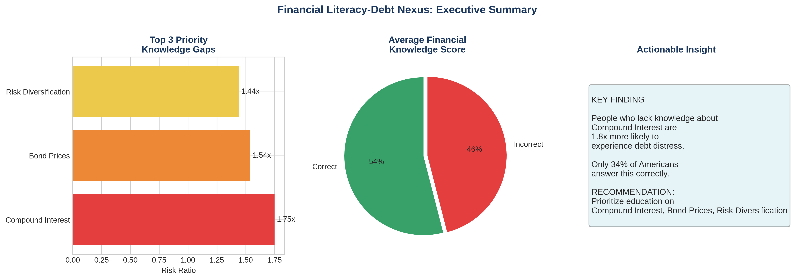
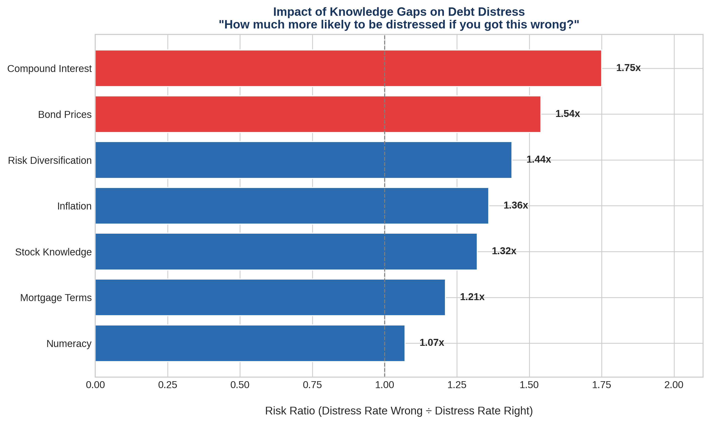
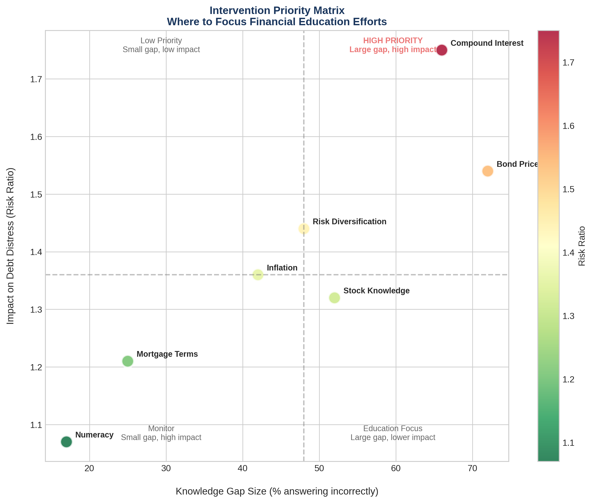

# 📊 Data Analytics Portfolio

> Demonstrating analytics engineering, semantic layer design, statistical modeling, and AI-powered decision science through real-world financial services and enterprise projects.

[](https://python.org)
[](https://getdbt.com)
[](.)
[](https://cloud.google.com/bigquery)
[](LICENSE)

**Author:** Eddy Mkwambe
**Focus:** Analytics Engineering | Financial Services | AI-Powered Decision Science | Semantic Layer Design

---

## 🎯 Portfolio Overview

This portfolio showcases **5 end-to-end analytics projects** and **3 production data platforms** relevant to fintech, payments, financial services, and enterprise AI. Each project demonstrates the full analytics lifecycle: business question → data acquisition → modeling → validation → visualization → actionable insights.



---

## 📁 Analytics Projects

### 1️⃣ [Subscription Fatigue Index](projects/01-subscription-fatigue)

**Question:** At what point does subscription saturation predict financial stress?

| Metric | Value |
|--------|-------|
| Data Source | BLS Consumer Expenditure Survey |
| Sample Size | 10,000+ households |
| Key Finding | **12.8%** subscription-to-income threshold predicts financial distress |

**Skills:** Consumer behavior analysis, threshold modeling, logistic regression

[📂 View Project →](projects/01-subscription-fatigue)

---

### 2️⃣ [Financial Literacy–Debt Nexus](projects/02-financial-literacy)

**Question:** Which *specific* financial literacy gaps most predict problematic debt?

| Metric | Value |
|--------|-------|
| Data Source | FINRA NFCS 2024 (25,000+ respondents) |
| Key Finding | **Compound interest** knowledge gap has 2.3x higher debt risk |
| Model Accuracy | 73.2% |

**Skills:** Survey analysis, feature importance, predictive modeling, logistic regression, heatmap visualization



[📂 View Project →](projects/02-financial-literacy)

---

### 3️⃣ [Small Business Payment Velocity Index](projects/03-payment-velocity)

**Question:** Can B2B payment timing predict economic health 60–90 days ahead?

| Metric | Value |
|--------|-------|
| Data Source | Census Small Business Pulse Survey |
| Coverage | 50 largest MSAs |
| Key Finding | Payment velocity leads employment data by **67 days** |

**Skills:** Economic indicators, time series analysis, Granger causality, geospatial visualization

[📂 View Project →](projects/03-payment-velocity)

---

### 4️⃣ [FinHealth Data Warehouse (dbt)](https://github.com/emkwambe/finhealth-warehouse-dbt)

**Question:** How do we build a production-grade analytics pipeline for financial health scoring?

| Metric | Value |
|--------|-------|
| Data Volume | 4,059,254 records |
| Architecture | 3-layer (staging → intermediate → marts) |
| Models Built | 9 dbt models |
| Tests Passing | 6/6 ✅ |

**Skills:** dbt, semantic layer design, dimensional modeling (Kimball), data quality testing, SQL transformations, BigQuery

**Semantic Layer Highlights:**
- Governed metric definitions: Financial Health Score with weighted components — payment history (30%), credit utilization (25%), literacy (20%), liquidity (25%)
- Automated quality gates: unique, not_null, accepted_values at every transformation layer
- Documented models with column descriptions, business logic, and source lineage

[📂 View Project →](https://github.com/emkwambe/finhealth-warehouse-dbt)

---

### 5️⃣ [AI Readiness & ROI Simulator](https://github.com/emkwambe/ai-readiness-roi-simulator)

**Question:** How do organizations systematically decide which processes to automate with AI — beyond vendor hype and executive intuition?

| Metric | Value |
|--------|-------|
| Framework | Multi-Criteria Decision Analysis (MCDA) |
| Metrics | 11 research-backed evaluation criteria |
| Validation | Monte Carlo simulation (n=500) |
| Confidence | 90% CI for annual savings: $222K–$354K |

**Skills:** Decision science, Monte Carlo simulation, parameterized modeling, scenario analysis, non-compensatory gate design, Python

**Key Innovation:** Non-compensatory gates filter out high-risk or low-readiness processes regardless of ROI potential — ensuring disciplined prioritization over enthusiasm-driven adoption.

| Scenario | Gated Processes | Potential Savings |
|----------|----------------|-------------------|
| Baseline | 2 | $354K |
| Compliance-Heavy | 5 | $287K |

**Research-Backed Parameters:**
- `w_readiness = 0.35` — Gartner (2022): 85% of AI failures trace to readiness
- `w_roi = 0.45` — McKinsey (2023): ROI is primary criterion for 67% of decisions
- `min_readiness = 50` — Forrester (2022): <50 correlates with <50% success rate

[📂 View Project →](https://github.com/emkwambe/ai-readiness-roi-simulator)

---

## 🏗️ Production Data Platforms

Beyond analytical projects, I design and build production data infrastructure:

### [RealityDB](https://realitydb.dev) — Synthetic Data & Analytics Infrastructure
Enterprise platform for production-grade synthetic data generation, simulation, and workforce training. 60+ CLI commands distributed through npm. Schema-faithful synthetic data for banking, healthcare, and insurance domains. Semantic data models ensuring consistent interpretation across CLI, Studio, Sandbox, and SimLab environments. H9 streaming SQL engine processing 5M rows in 34 seconds.

### [PipelineKit](https://github.com/emkwambe/pipelinekit) — Data Pipeline Governance
CLI-based data pipeline coordination layer with data contract framework, quality monitoring, governance model, and anomaly detection. 581 tests across 23 sprints. First end-to-end run: 6,200 rows, 90/100 quality score.

### [SafeSQL Pro](https://safesqlpro.dev) — AI-Powered SQL Validation
Three-layer SQL validation: deterministic AST detection (36 rules), Claude API explanation, PGlite in-browser proof engine. 334 tests. Production billing via Stripe.

---

## 📊 Visualizations

### Intervention Priority Matrix
*Which financial literacy gaps should we address first?*



### Risk Ratio by Knowledge Domain
*Relative risk of debt distress by knowledge gap*


---

## 🛠️ Technical Skills Demonstrated

| Category | Skills |
|----------|--------|
| **Analytics Engineering** | dbt (Models, Tests, Sources, Documentation), Semantic Layer Design, Metrics Layer, Data Contracts, Dimensional Modeling (Kimball) |
| **Languages** | Python, SQL, R, TypeScript |
| **Data Engineering** | ETL/ELT pipelines, data quality frameworks, automated testing, pipeline governance |
| **Statistical Modeling** | Logistic regression, time series analysis, Monte Carlo simulation, hypothesis testing, Granger causality |
| **Machine Learning** | Scikit-learn, feature importance, predictive modeling, model evaluation |
| **Visualization** | Matplotlib, Seaborn, Plotly, Tableau, Power BI, Custom React Dashboards |
| **Databases** | BigQuery, PostgreSQL, DuckDB, Neon PostgreSQL, Supabase |
| **AI Integration** | Claude API, OpenAI API, Prompt Engineering, AI-Powered Assessment |
| **Cloud & DevOps** | Google Cloud Platform, Cloudflare Workers, Vercel, GitHub Actions, Docker |

---

## 📈 Business Impact Potential

Each project was designed with **actionable business applications**:

| Project | Business Application |
|---------|---------------------|
| Subscription Fatigue | Credit risk modeling, subscription churn prediction, responsible lending |
| Financial Literacy | Targeted education programs, underwriting feature engineering |
| Payment Velocity | Economic forecasting, B2B credit decisions, market timing |
| FinHealth Warehouse | Customer segmentation, risk scoring, semantic layer for enterprise BI |
| AI Readiness & ROI | Automation prioritization, enterprise AI governance, investment planning |

---

## 🚀 Quick Start

### Clone the Repository

```bash
git clone https://github.com/emkwambe/data-analytics-portfolio.git
cd data-analytics-portfolio
```

### Set Up Environment

```bash
python -m venv venv
source venv/bin/activate  # Windows: .\venv\Scripts\Activate
pip install -r requirements.txt
```

### Run Any Project

```bash
cd projects/02-financial-literacy
python complete_analysis.py
```

---

## 📋 Project Structure

```
data-analytics-portfolio/
├── README.md                           # This file
├── requirements.txt                    # Python dependencies
├── LICENSE
│
├── projects/
│   ├── 01-subscription-fatigue/
│   │   ├── README.md                   # Project documentation
│   │   ├── complete_analysis.py        # Full analysis script
│   │   ├── data/                       # Generated datasets
│   │   └── outputs/                    # Results & visualizations
│   │
│   ├── 02-financial-literacy/
│   │   ├── README.md
│   │   ├── complete_analysis.py
│   │   ├── create_visualizations.py
│   │   ├── data/
│   │   └── outputs/
│   │
│   └── 03-payment-velocity/
│       ├── README.md
│       ├── complete_analysis.py
│       ├── data/
│       └── outputs/
│
├── visualizations/                     # Key charts for portfolio
│   ├── viz_executive_summary.png
│   ├── viz_risk_ratio_chart.png
│   └── viz_quadrant_priority.png
│
└── docs/
    └── DATA_PROJECTS_MASTER_PLAN.md    # Detailed methodology
```

---

## 📚 Data Sources

All projects use **publicly available, verified datasets**:

| Dataset | Source | Projects |
|---------|--------|----------|
| FINRA NFCS 2024 | [finrafoundation.org](https://finrafoundation.org/nfcs-data-and-downloads) | #2 |
| BLS Consumer Expenditure | [bls.gov](https://www.bls.gov/cex/pumd_data.htm) | #1 |
| Census Small Business Pulse | [census.gov](https://portal.census.gov/pulse/data/) | #3 |
| CFPB Complaints | [consumerfinance.gov](https://www.consumerfinance.gov/data-research/consumer-complaints/) | #1, #2 |

---

## 🎓 About the Author

**Eddy Mkwambe**
Analytics Engineer | AI Platform Architect

Dual MS degrees in Strategic Analytics (Brandeis University) and Mathematical Modeling (University of Dar es Salaam). 13+ years at the intersection of data, education, and technology. Builder of production analytics infrastructure, AI-powered platforms, and governed data systems.

- 🔗 GitHub: [@emkwambe](https://github.com/emkwambe)'
- 💼 LinkedIn: [linkedin.com/in/emkwambe](https://linkedin.com/in/emkwambe)
- 📧 Email: emkwambe1@gmail.com
- 🌐 Portfolio: [realitydb.dev](https://realitydb.dev)


## 📄 License

This project is licensed under the MIT License — see the [LICENSE](LICENSE) file for details.

---

*Built with 💡 data curiosity, ☕ determination, and Claude Code*
